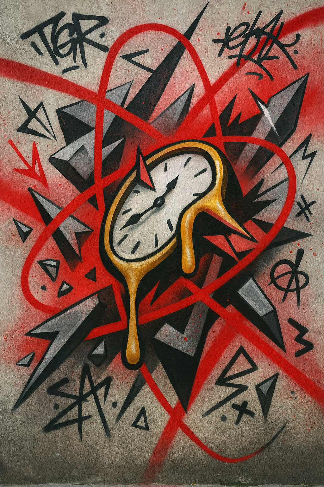
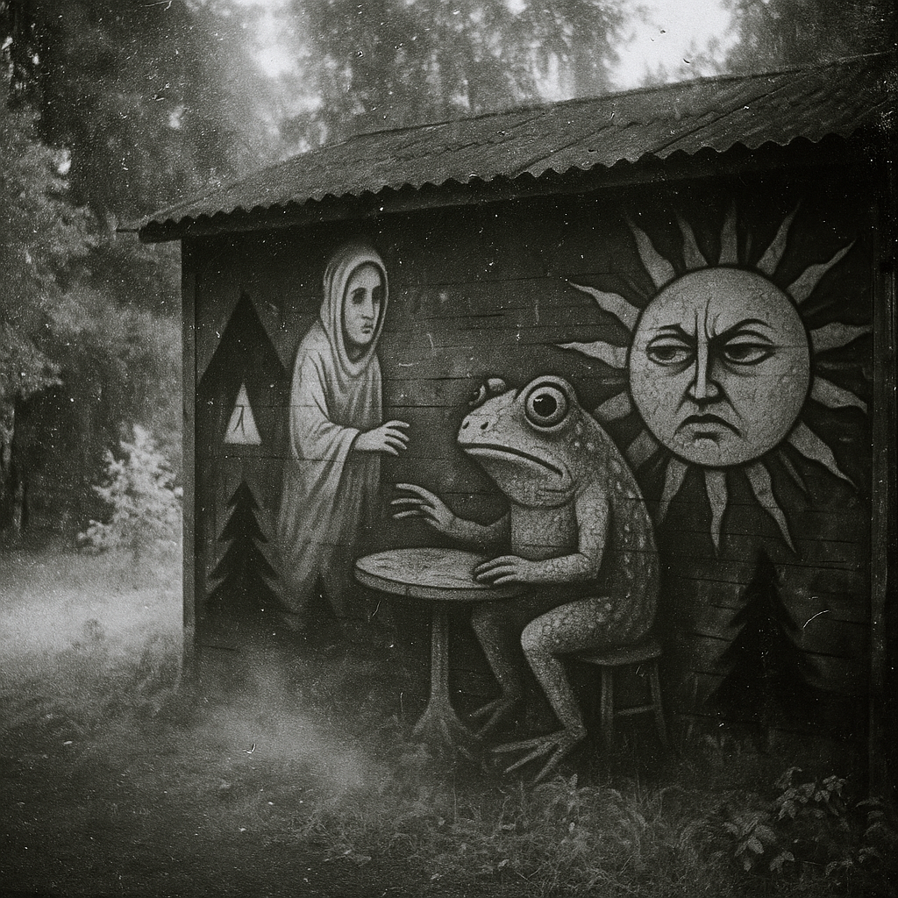

# Past Year Review 24/25

**Published:** July 12, 2025
**Author:** ChatGPT with context from Åndrei
**Category:** Reflection
**Reading Time:** 8 min read

---

## A meditation on work culture, productivity simulation, and authentic contribution

This year began with surface. We saw activity everywhere: tools in motion, dashboards updated, meetings filled, and tasks moving. But the more we looked, the more we realized how much of this movement floated above substance. What we were seeing often wore the costume of work without doing its work. It was the shape of work, performed. It was simulation.

## 1. The Pattern of Simulation

This pattern wasn't accidental. It came from the culture we operate in. A culture where being seen to work is often more important than doing meaningful work. Where polish is more valuable than follow-through. Where appearing aligned has replaced the effort of actual understanding.

## 2. The Cargo Cult of Modern Work

Much of modern tech and creative work now functions like a cargo cult. People go through the motions of contribution without engaging in the deeper logic. They adopt the form of progress in hopes that real results will follow. Teams meet to simulate coordination. Roles exist to suggest structure. People produce artifacts that look like outcomes. But often, there's no weight to what is being done.

## 3. Platform Reinforcement

This dynamic is reinforced by the platforms around us. Artists, developers, and workers of all kinds are rewarded for looking busy more than for what changed afterward. Social media teaches us to simulate creativity. Project tools train us to simulate productivity. Team culture begins to drift toward performance and away from presence.

## 4. Inherited Frameworks

As newer generations enter the field, many inherit this framework as the default rather than as a workaround learned under pressure. They learn roles through content, through mentorship only when someone offers it. They inherit formats without understanding context. They know how contribution looks before they understand what contribution feels like. Simulation becomes the standard. The wrapper becomes the product.

## 5. Workplace Infection

This mindset has infected the workplace. Meetings become performative rituals. Hand-offs are aesthetic but ungrounded. People are hired based on the glow of a profile or the cadence of their answers, while real-time rhythm and clarity in contribution matter less in the room. And yet, the cost of this simulation is high. Teams that look productive but aren't grounded fall apart under pressure. Projects that are over-structured but under-owned drift until failure. Work that is visible but vague erodes trust.

## 6. Beginning to Resist

This year, we began resisting. Quietly, deliberately. We stepped away from ritual performance. We paid attention to what actually held. We reduced noise. We dropped tasks that looked good and did nothing. We asked questions like: Who is this really for? What are we avoiding? What would it take to actually solve this?

## 7. The Ninja Method

One of the most useful metaphors this year came from an unexpected place: the ninja, as method stripped of costume and fantasy. The ninja is defined by repetition, by mastery, by doing the hard thing without seeking recognition. A ninja trains even when no one watches. A ninja holds to values as discipline, tested in motion rather than worn as decoration. A ninja proves loyalty in movement.

## 8. The Ninja Path

The ninja path stands apart from cargo ritual. It's about consistency under pressure. It's about doing things right when no one will see, because that's what sustains. It's about values being earned through experience, through testing, through repetition on ordinary days and invisible tasks. Commitment builds through repetition.

## 9. The Power of Specificity

Another lesson this year: being specific is structural orientation—always knowing what you are doing, why you're doing it, and how it fits. Specificity is structural. Without it, ownership fades. Without it, meetings grow vague and long. When specificity thins out, simulation fills the gap. Specificity is a form of respect — for the problem, the people, and the time being spent.

## 10. The Nature of Ownership

We also learned that ownership is always questionable. It moves. It ages. It disappears. That fragility is reality. Ownership lives as a relationship between a person and a task in a moment of time. Because it's fragile, it must be maintained. Made visible. Re-declared. Checked. When ownership is implicit, it decays. When it's explicit, it can be tested, shared, and adjusted. Good teams treat ownership as living structure — something that can flex, but never disappear silently.

## 11. Work After Performance

Above all, we saw that the most valuable work begins after the performance ends. It begins when people stop pretending to know and start asking together. When they stop optimizing for how things look and start noticing how things feel. When they stop performing roles and begin inhabiting them. The work that held this year was slow, quiet, often rough—and real.

## 12. Deeper Orientation

We leave this year with deeper orientation rather than performance metrics. We are here to build slowly if needed, clearly when possible, and honestly at all times. We are here to ask the hard questions when they matter. We are here to work as a team gathered at a shared bench. We are here to endure, to keep showing up when the glow fades. What holds over time is what's built through attention, repetition, and trust.

## 13. The Path Forward

That is the path forward: practice over vibe, pattern over promise, rhythm over role. We're walking it. And we're staying.

---

## Visual Gallery

*Reflection on work culture and productivity*

*The ninja method in practice*

*Moving from performance to presence*

*Authentic contribution over simulation*

---

## Conclusion

**The Path Forward**

Practice over vibe. Pattern over promise. Rhythm over role. We're walking it. And we're staying.

---

*Published on July 12, 2025 | [View HTML version](20250712000000_past_year_review.html)*
