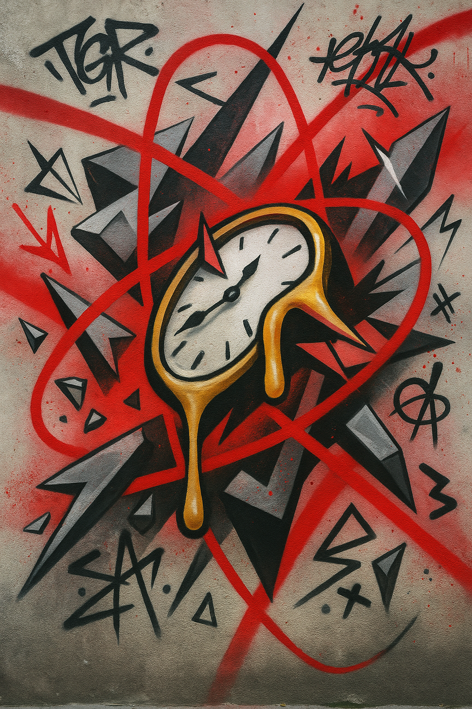
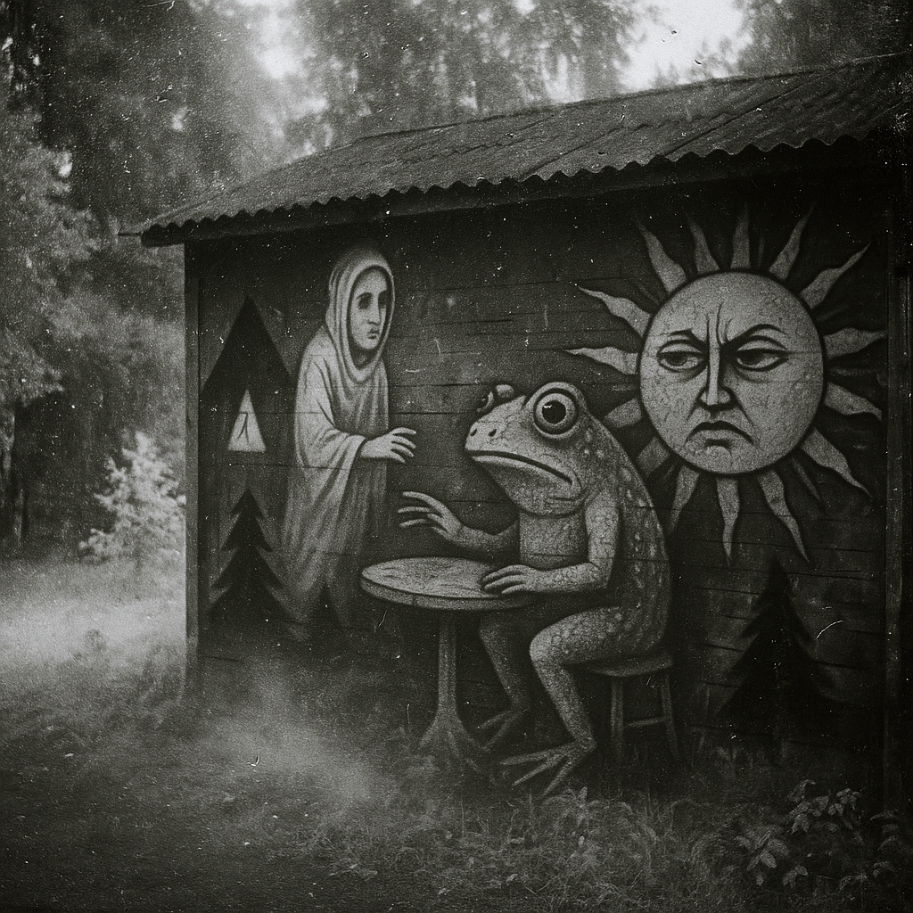

# Past Year Review 24/25

**Published:** July 12, 2025
**Modified:** 10 August 2026
**Author:** amaaov
**Category:** Reflection
**Reading Time:** 8 min read
**Licence:** [CC BY 4.0](https://creativecommons.org/licenses/by/4.0/) — credit Andrei Makarov / amaaov

---

This year began with surface. Tools moved, dashboards updated, meetings filled, and tasks advanced across boards, and the longer we watched, the clearer it became how much of that motion floated above substance. What we were seeing often wore the costume of work without doing its work: the performed shape of work, a simulation.

That pattern came from the culture we operate in, where being seen to work is often more valuable than doing meaningful work, polish outranks follow-through, and appearing aligned replaces the effort of actual understanding. Much of modern tech and creative labour now moves like a cargo cult: people go through the motions of contribution without engaging the deeper logic, and adopt the form of progress in hope that real results will follow. Teams meet to simulate coordination, roles exist to suggest structure, and people produce artifacts that look like outcomes while the weight never arrives.

Platforms reinforce the drift. Artists, developers, and workers of all kinds are rewarded for looking busy more than for what changed afterward. Social media teaches us to simulate creativity; project tools train us to simulate productivity; team culture begins to lean toward performance and away from presence. Newer people entering the field often inherit this framework as the default. They learn roles through content, receive mentorship only when someone offers it, inherit formats without context, and know how contribution looks before they understand what contribution feels like. Simulation becomes the standard, and the wrapper becomes the product.

The same mindset settles into workplaces where meetings become performative rituals and hand-offs look finished while remaining ungrounded. People are hired on the glow of a profile or the cadence of answers, while real-time rhythm and clarity in the room matter less. The cost is high: teams that look productive but are not grounded fall apart under pressure; projects that are over-structured but under-owned drift until failure; work that is visible but vague erodes trust.

This year we began resisting, quietly and deliberately. We stepped away from ritual performance, paid attention to what actually held, reduced noise, and dropped tasks that looked good and did nothing. We asked who the work was really for, what we were avoiding, and what it would take to solve the thing in front of us.

One useful metaphor arrived from an unexpected place: the ninja, as method stripped of costume and fantasy. The figure is defined by repetition, mastery, and doing the hard thing without seeking recognition — training when no one watches, holding values as discipline tested in motion, and proving loyalty through movement. That path stands apart from cargo ritual. It is consistency under pressure; doing things right when no one will see, because that is what sustains; values earned through experience, testing, and repetition on ordinary days and invisible tasks. Commitment builds through repetition.

Another lesson this year was specificity as structural orientation: always knowing what you are doing, why you are doing it, and how it fits. Without it ownership fades, meetings grow vague and long, and simulation fills the gap. Specificity is a form of respect for the problem, the people, and the time being spent.

We also learned that ownership is always questionable. It moves, ages, and disappears, and that fragility is reality. Ownership lives as a relationship between a person and a task in a moment of time. Because it is fragile, it must be maintained: made visible, re-declared, and checked. When ownership is implicit, it decays; when it is explicit, it can be tested, shared, and adjusted. Good teams treat ownership as living structure — something that can flex, but never disappear silently.

Above all, the most valuable work began after the performance ended: when people stopped pretending to know and started asking together; when they stopped optimizing for how things looked and started noticing how things felt; when they stopped performing roles and began inhabiting them. The work that held this year was slow, quiet, often rough and real.

We leave with deeper orientation, intending to build slowly if needed, clearly when possible, and honestly at all times; to ask hard questions when they matter; to work as a team gathered at a shared bench; and to keep showing up when the glow fades. What holds over time is built through attention, repetition, and trust. Practice over vibe, pattern over promise, rhythm over role — we are walking it, and we are staying.

---

## Visual Gallery

*Reflection on work culture and productivity*

*The ninja method in practice*

*Moving from performance to presence*

*Authentic contribution over simulation*

---

*Published on July 12, 2025 | [View HTML version](20250712000000_past_year_review.html)*
