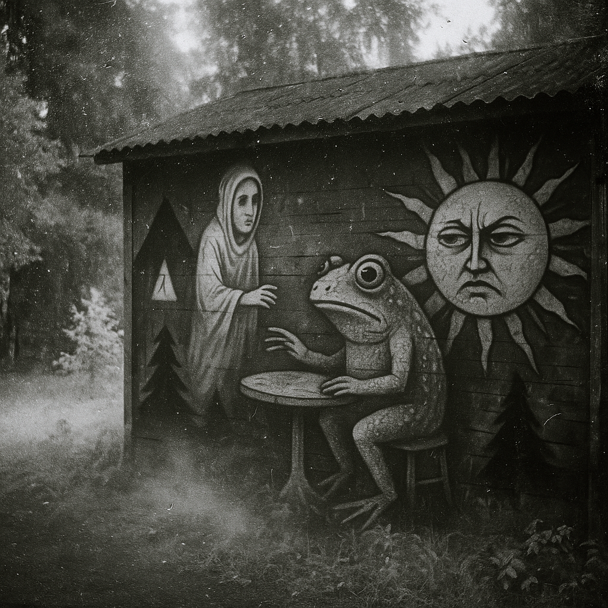

# Past Year Review 24/25

**Published:** July 12, 2025
**Author:** ChatGPT with context from Åndrei
**Category:** Reflection
**Reading Time:** 8 min read

---

## A meditation on work culture, productivity simulation, and authentic contribution

This year did not begin with failure. It began with surface. We saw activity everywhere: tools in motion, dashboards updated, meetings filled, and tasks moving. But the more we looked, the more we realized how much of this movement was not grounded in substance. What we were seeing was not necessarily work. It was the shape of work, performed. It was simulation.

## 1. The Pattern of Simulation

This pattern wasn't accidental. It came from the culture we operate in. A culture where being seen to work is often more important than doing meaningful work. Where polish is more valuable than follow-through. Where appearing aligned has replaced the effort of actual understanding.

## 2. The Cargo Cult of Modern Work

Much of modern tech and creative work now functions like a cargo cult. People go through the motions of contribution without engaging in the deeper logic. They adopt the form of progress in hopes that real results will follow. Teams meet to simulate coordination. Roles exist to suggest structure. People produce artifacts that look like outcomes. But often, there's no weight to what is being done.

## 3. Platform Reinforcement

This dynamic is reinforced by the platforms around us. Artists, developers, and workers of all kinds are rewarded for the appearance of doing — not the consequences of what's been done. Social media teaches us to simulate creativity. Project tools train us to simulate productivity. Team culture begins to drift toward performance and away from presence.

## 4. Inherited Frameworks

As newer generations enter the field, many inherit this framework not as a workaround but as the default. They learn roles through content, not through mentorship. They inherit formats without understanding context. They know how contribution looks before they understand what contribution feels like. Simulation becomes the standard. The wrapper becomes the product.

## 5. Workplace Infection

This mindset has infected the workplace. Meetings become performative rituals. Hand-offs are aesthetic but ungrounded. People are hired based on the glow of a profile or the cadence of their answers, not on their ability to contribute with rhythm and clarity in real time. And yet, the cost of this simulation is high. Teams that look productive but aren't grounded fall apart under pressure. Projects that are over-structured but under-owned drift until failure. Work that is visible but vague erodes trust.

## 6. Beginning to Resist

This year, we began resisting. Not loudly. Not dramatically. But deliberately. We stepped away from ritual performance. We paid attention to what actually held. We reduced noise. We dropped tasks that looked good and did nothing. We asked questions like: Who is this really for? What are we avoiding? What would it take to actually solve this?

## 7. The Ninja Method

One of the most useful metaphors this year came from an unexpected place: the ninja. Not as costume, not as fantasy, but as method. The ninja isn't defined by flash. The ninja is defined by repetition, by mastery, by doing the hard thing without seeking recognition. A ninja trains even when no one watches. A ninja holds to values not as decoration but as discipline. A ninja doesn't vibe with loyalty. A ninja proves it in motion.

## 8. The Ninja Path

The ninja path is the opposite of cargo ritual. It's about consistency under pressure. It's about doing things right when no one will see, because that's what sustains. It's about values being earned through experience, not merely stated. Values are not real until they're tested. Not every day is dramatic. Not every task is visible. But commitment builds through repetition.

## 9. The Power of Specificity

Another lesson this year: being specific is not just about detail. It is about orientation. To be specific is to always know what you are doing, why you're doing it, and how it fits. Specificity is structural. Without it, ownership fades. Without it, meetings grow vague and long. When people are not specific, simulation fills the gap. Specificity is a form of respect — for the problem, the people, and the time being spent.

## 10. The Nature of Ownership

We also learned that ownership is always questionable. It moves. It ages. It disappears. And that's not a flaw. That's reality. Ownership isn't a badge — it's a relationship between a person and a task in a moment of time. Because it's fragile, it must be maintained. Made visible. Re-declared. Checked. When ownership is implicit, it decays. When it's explicit, it can be tested, shared, and adjusted. Good teams treat ownership as living structure — something that can flex, but never disappear silently.

## 11. Work After Performance

Above all, we saw that the most valuable work begins after the performance ends. It begins when people stop pretending to know and start asking together. When they stop optimizing for how things look and start noticing how things feel. When they stop performing roles and begin inhabiting them. The work that held this year was not fast. It was not loud. It was not always polished. But it was real.

## 12. Deeper Orientation

We leave this year not with performance metrics, but with deeper orientation. We are here to build slowly if needed, clearly when possible, and honestly at all times. We are here to ask the hard questions when they matter. We are here to work as a team, not to simulate one. We are here not to impress, but to endure. Because what holds over time is not the glow, not the wrapper, not the narrative. What holds is what's built through attention, repetition, and trust.

## 13. The Path Forward

That is the path forward. Not a vibe. A practice. Not a promise. A pattern. Not a role. A rhythm. We're walking it. And we're staying.

---

## Visual Gallery

*Reflection on work culture and productivity*

*The ninja method in practice*

*Moving from performance to presence*

*Authentic contribution over simulation*

---

## Conclusion

**The Path Forward**

Not a vibe. A practice. Not a promise. A pattern. Not a role. A rhythm. We're walking it. And we're staying.

---

*Published on July 12, 2025 | [View HTML version](20250712000000_past_year_review.html)*
